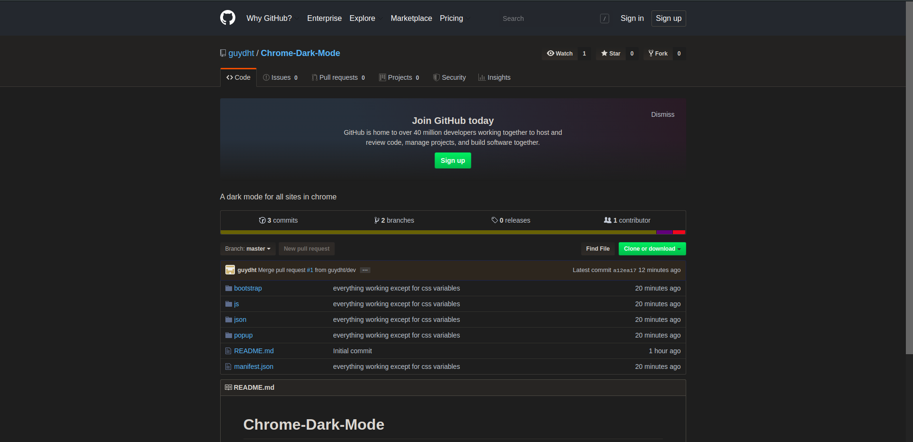
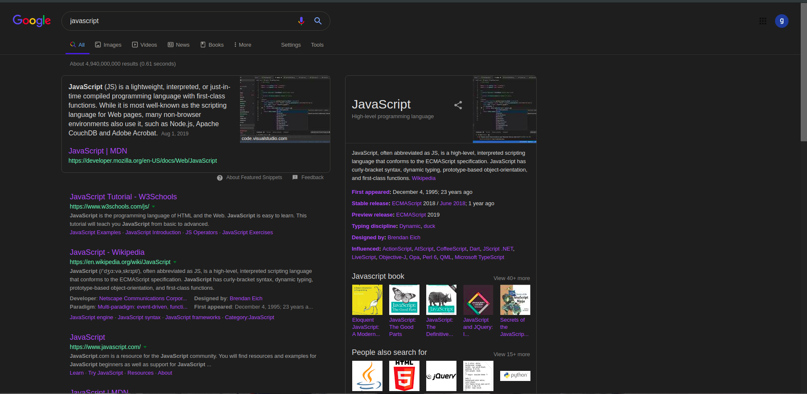
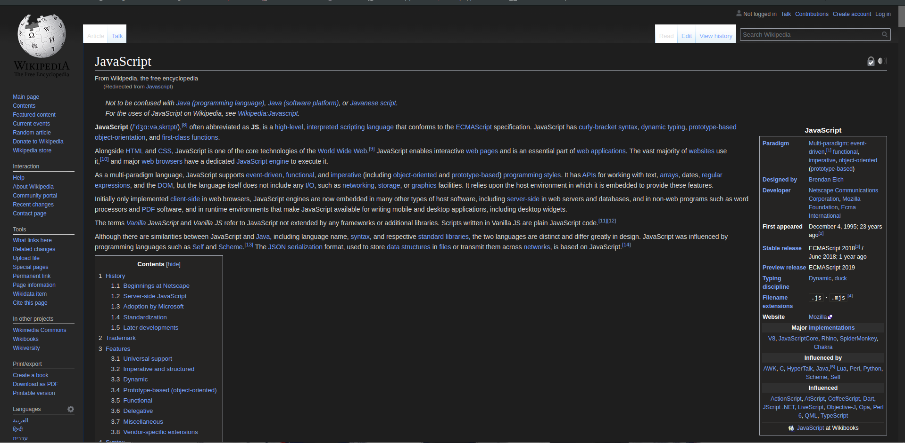

# Global-Dark-Mode (For Chrome)
A dark mode for all sites in chrome

> ## Features:  
>
> Dark mode Toggle ON/OFF
>
> Blacklist/Whitelist of domains to activate dark mode in them
>
> *TODO: Control the brightness of backgrounds
>
> *TODO: Smooth transition when toggling dark theme

## Screenshots:

